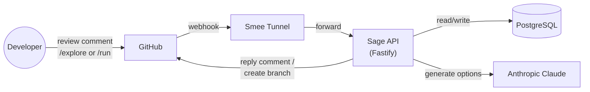
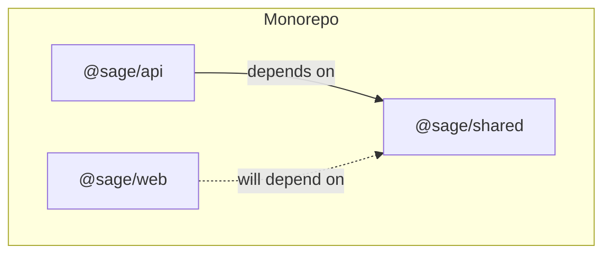
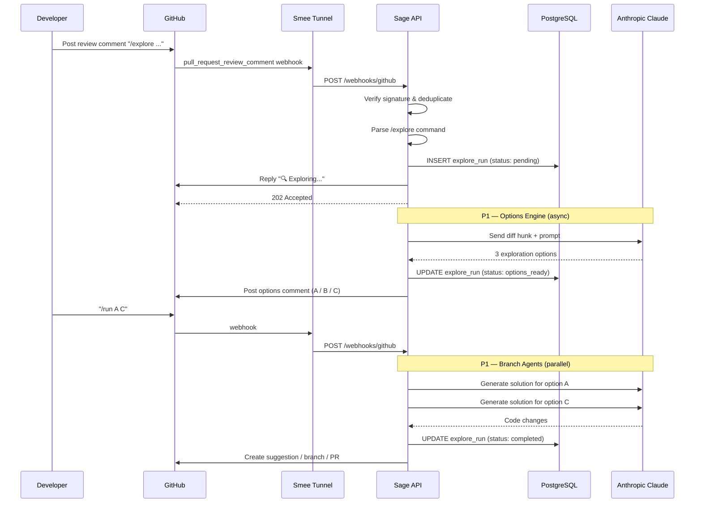
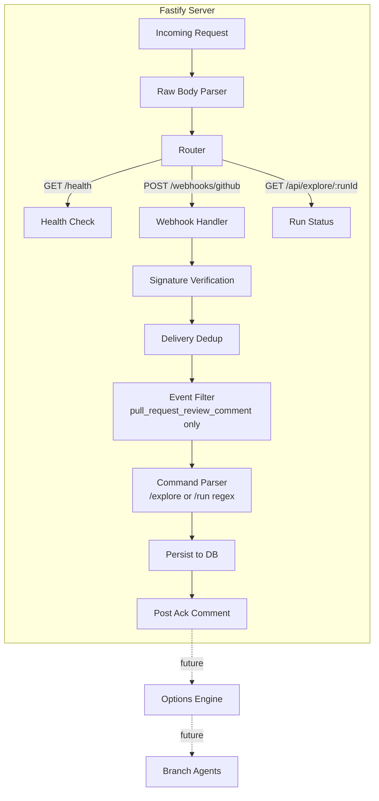
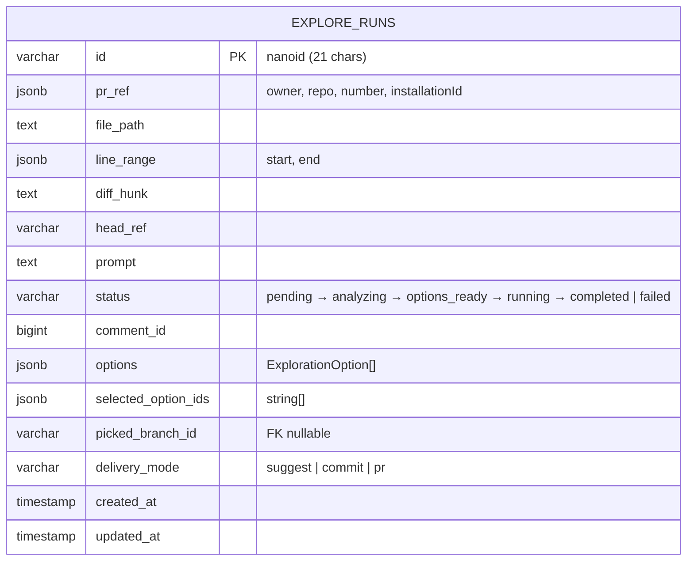
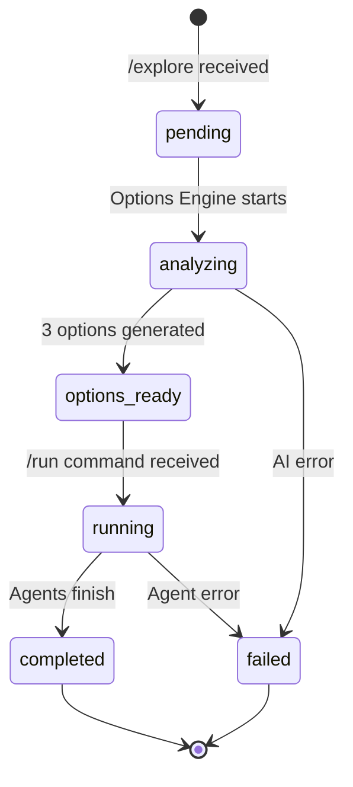
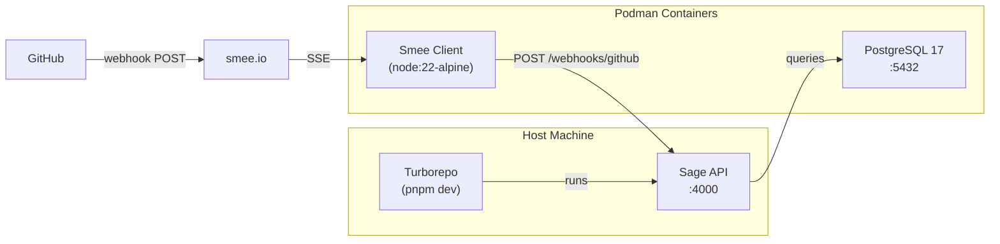

# Sage — Architecture Overview

Sage is a multi-agent solution explorer that plugs into GitHub pull-request
reviews. A reviewer types `/explore "question"` on a code range, and Sage
generates multiple refactoring options, each validated in a sandbox, so the
team can pick the best path forward.

---

## System Context



---

## Monorepo Layout

```
sage/
├── packages/
│   ├── api/         # Fastify server — webhooks, AI orchestration, DB
│   ├── shared/      # Types, constants, regex shared across packages
│   └── web/         # (future) Dashboard UI
├── docs/            # Project documentation
├── scripts/         # Dev helper scripts
├── docker-compose.yml   # Postgres + Smee tunnel services
└── turbo.json       # Turborepo pipeline config
```



---

## Request Flow

When a developer posts a `/explore` or `/run` command on a PR review comment,
the following sequence executes:



---

## API Internals



---

## Data Model



### Explore Run Lifecycle



---

## Infrastructure (Local Dev)



| Service   | Runs In          | Started By                |
| --------- | ---------------- | ------------------------- |
| PostgreSQL | Podman container | `podman compose up`       |
| Smee       | Podman container | `podman compose --profile tunnel up` |
| Sage API   | Host (Node 22)   | `turbo dev`               |

One command: **`pnpm dev:up`** starts everything.

---

## Tech Stack

| Layer       | Technology                          |
| ----------- | ----------------------------------- |
| Runtime     | Node 22, TypeScript                 |
| API         | Fastify 5                           |
| Database    | PostgreSQL 17, Drizzle ORM          |
| AI          | Vercel AI SDK + Anthropic (Claude)  |
| GitHub      | Octokit, GitHub App webhooks        |
| Build       | Turborepo, tsup, pnpm 10           |
| Containers  | Podman                              |
